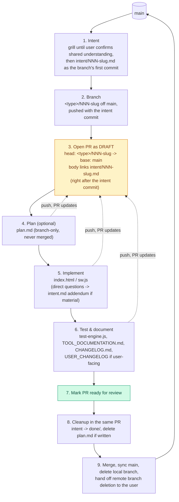

# Contributing

This repo's requirement lifecycle (intent → branch → draft PR → implement →
merge) is defined in `CLAUDE.md`. This file is the fuller, step-by-step
walkthrough of that same lifecycle — for a human contributor or an agent
picking up work in this repo, especially across multiple devices or
sessions.

## Why this matters: work here is picked up across devices

There's no external issue tracker — `intent/`, `plan.md` (when one is
written) and the PR itself *are* the tracker. Work on a given requirement
can start on one device or agent session and continue on a completely
different one (a laptop, a phone, a different Claude Code session, a
CI-triggered agent). The only thing every one of those has in common is
GitHub. So:

**Push every commit, and open the PR as early as possible — right after the
intent's commit, before plan or implementation exist.** (GitHub won't open
a PR with no diff between head and base; the intent, committed as the
branch's first commit, is what gives the PR something to show. See step 3
below.) An uncommitted local branch, or a pushed branch with no PR, is
invisible to whoever/whatever picks this up next. A pushed branch with an
open (draft) PR is not — its diff, its description, and its checklist of
what's done are all one link away, from any device.

**This lifecycle applies to bug fixes too, not just new features.** A bug
report still gets an intent file first — what's broken, how it was
observed — before any code changes, even when the fix turns out to be a
few lines. The only difference for a bug is the branch name (step 2).

**There's one approval checkpoint, and it's during grilling, not after.**
Grilling ends with the user confirming a shared understanding of the
requirement — that confirmation is what authorizes writing the intent file
and delivering the feature. Nothing later in the lifecycle pauses for a
further "does this look right?" A question that comes up mid-implementation
and that grilling didn't already settle goes straight to the user (see step
1), not into a written spec document — this repo doesn't use a spec step.

## The lifecycle

1. **Intent** — first run the `grilling` skill (model-invoked) — or the
   user-invoked `grill-me` skill if you're a human contributor — to get
   interrogated about the requirement until every branch of its design tree
   is resolved (see `.claude/skills/grill-me/` and `.claude/skills/grilling/`).
   Then create the requirement's branch (step 2) and write
   `intent/NNN-slug.md` on it from those resolved decisions, describing
   what's wanted and why (for a bug: what's broken and how it was
   observed). Commit it as the branch's first commit. Never commit it to
   `main`: `main` only changes via a reviewed PR (see `CLAUDE.md`'s
   "Branch protection"), so the intent reaches `main` through this
   requirement's own PR. If a question comes up later that grilling didn't
   cover, ask the user directly; when the answer materially changes scope
   or behaviour, append it to `intent/NNN-slug.md` as a dated addendum (a
   new commit, never rewriting the original) and push — the open PR
   updates with it.
2. **Branch** — create `<type>/NNN-slug` off `main`, following the
   [Conventional Branch](https://conventionalbranch.org) spec (see
   `.claude/skills/conventional-branch/`): `<type>` is `feature`, `bugfix`,
   `hotfix`, `release`, or `chore` for the nature of the requirement (most
   are `feature/`; a bug fix is `bugfix/`, not the repo's earlier ad-hoc
   `bug/` prefix, to stay within the published spec), and `NNN-slug` is named
   after the intent's slug as before (e.g. `feature/003-inheritance-tax`,
   `bugfix/006-mobile-data-menu-overflow`). Create it once grilling has
   settled the slug, commit the intent to it (step 1), and push.
3. **Open the PR — as a draft, as soon as the intent commit is pushed.**
   GitHub refuses to open a PR with zero diff between head and base; the
   intent commit is the branch's first diff against `main`, so the PR can
   open right away. Title the PR after the requirement; body references the
   intent file path (e.g. "Implements `intent/003-inheritance-tax.md`") and
   says what stage the work is at. See "Opening the PR" below for the exact
   command. This is still the step people skip and the step that matters
   most for cross-device continuity — do it the moment it's possible, not
   once the code is ready. Subscribe to the PR's activity immediately once
   it's open — don't wait to be asked. This repo's standing preference is
   that an agent session watches every PR it opens here through to merge
   or close, per the PR-babysitting rules in the system prompt.
4. **Plan (optional)** — if breaking the requirement into an implementation
   sequence is actually useful, write `plan.md` on the branch and push it;
   for a small or self-contained change, skip straight to implementing
   (step 5). When written, it's a working file only — it gets deleted in
   the same PR that implements the requirement, never merged to stay.
5. **Implement** — make the change (see `CLAUDE.md`'s "Working in this
   repo" for `index.html`/`sw.js` conventions). Push commits as you go
   rather than batching everything into one commit at the end — every push
   updates the same open PR, so progress is visible from any device
   watching it.
6. **Test & document** — run `node tests/test-engine.js`, validate
   calculation changes against `docs/TOOL_DOCUMENTATION.md` §5.4, update
   `docs/TOOL_DOCUMENTATION.md` itself, add a `CHANGELOG.md` entry, and
   add a `USER_CHANGELOG` entry in
   `index.html` if — and only if — the change is user-facing (`CLAUDE.md`
   has the exact test). Push.
7. **Mark the PR ready for review** once implementation, tests and docs are
   all pushed — this is the signal that the draft is now a real review
   request, not just an in-progress marker.
8. **Cleanup, in the same PR** — move `intent/NNN-slug.md` into
   `intent/done/`, and `git rm plan.md` if one was written. A merged PR
   should leave neither behind in the live `intent/` directory or repo
   root.
9. **Merge, then sync `main` and hand off branch cleanup.** Check out
   `main`, fetch, fast-forward-merge (`git checkout main && git fetch
   origin main && git merge --ff-only origin/main`) so the local
   checkout matches what's live, then delete the local copy of the
   branch (`git branch -d <type>/NNN-slug`). The remote branch can't be deleted
   from this environment — this git proxy rejects `git push --delete`
   with a 403, and no GitHub MCP tool here deletes branches either. Don't
   keep retrying either approach: give the user a direct link to
   **https://github.com/aggallim/retirement-planner/branches** (or point
   out the "Delete branch" button GitHub shows on the merged PR's own
   page) and let them do it. A merged, undeleted remote branch is inert —
   this is a hand-off for convenience, not something blocking anything.



The dotted arrows are the point: steps 4 through 6 don't happen in one
sitting on one machine. Each one is a push to the same branch, updating the
same already-open PR — so whoever (or whatever) continues the work next just
needs the PR link, not a handoff.

## Opening the PR

Once the branch is pushed with the intent commit on it (a PR needs at
least one commit ahead of `main` to open):

```sh
git push -u origin <type>/NNN-slug
gh pr create --draft --base main --head <type>/NNN-slug \
  --title "Short description of the requirement" \
  --body "Implements intent/NNN-slug.md. Status: intent pushed, implementing."
```

For a bug fix, use `bugfix/NNN-slug` as the branch name in both commands
above instead of `feature/NNN-slug`.

No GitHub CLI available? Use the GitHub web UI's "compare & pull request"
prompt after pushing, or the GitHub API/MCP tooling if you're an agent with
access to it — same result: a draft PR, base `main`, head `<type>/NNN-slug`, body
linking the intent file.

Update the PR body's "Status" line as you move through the lifecycle (it's
cheap, and it's what tells the next session where things stand without
reading every commit). Mark it ready for review at step 7.

**This repo has no `.github/pull_request_template.md`.** If one is added
later, follow its structure for the PR body instead of the free-form
"Implements + Status" line above.

## Agent sessions with a harness-assigned branch

Some agent environments (e.g. Claude Code remote sessions) assign a branch
up front, with a random name like `claude/pensive-newton-rymumn`. That name
passes Conventional Branch's grammar through its `claude/` AI-agent prefix,
but it fails the `conventional-branch` skill's description guidelines and
this repo's `<type>/NNN-slug` scheme: it says nothing about the work, its
type, or which intent it belongs to. **Don't use it for requirement
work.**

Instead, follow step 2 exactly as a human contributor would: create
`<type>/NNN-slug` off `main`, push it, and do everything else (intent,
draft PR, plan, implementation) on that branch. Leave the harness-assigned branch
unused.

- **Permission.** This section (and `CLAUDE.md` step 2) is standing
  permission from the repo owner to push to a branch other than the one the
  harness assigned. An agent doesn't need to ask each session.
- **Fallback.** Pushing a new branch from a Claude Code remote session was
  tested and works. If the push is ever rejected (e.g. a proxy 403), don't
  keep retrying: work on the harness-assigned branch instead, open the PR
  from it, and tell the user why the name doesn't follow the convention.
- **Cleanup.** If the unused harness-assigned branch exists on the remote,
  it's inert. The user can delete it from
  **https://github.com/aggallim/retirement-planner/branches** along with
  merged branches (step 9).

## Other conventions

- One branch, one PR, per requirement — don't stack unrelated changes onto
  an open requirement PR.
- Commit messages and PR descriptions explain *why*, not just *what* — see
  `CLAUDE.md`'s general conventions.
- Everything else about working in this codebase (no build step, single-file
  PWA, performance rules, calculation verification checklist) is in
  `CLAUDE.md` — read that first.
