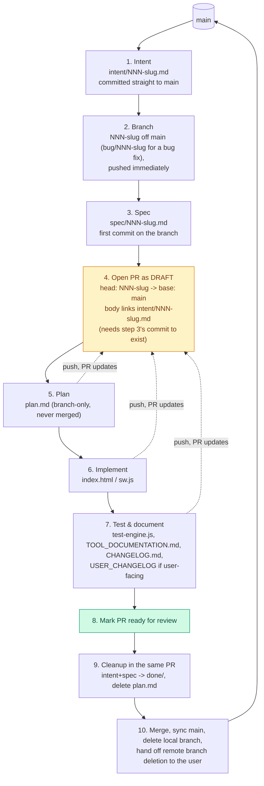

# Contributing

This repo's requirement lifecycle (intent → spec → branch → plan →
implement → PR → merge) is defined in `CLAUDE.md`. This file is the fuller,
step-by-step walkthrough of that same lifecycle — for a human contributor or
an agent picking up work in this repo, especially across multiple devices or
sessions.

## Why this matters: work here is picked up across devices

There's no external issue tracker — `intent/`, `spec/`, `plan.md` and the PR
itself *are* the tracker. Work on a given requirement can start on one
device or agent session and continue on a completely different one (a
laptop, a phone, a different Claude Code session, a CI-triggered agent). The
only thing every one of those has in common is GitHub. So:

**Push every commit, and open the PR as early as possible — right after the
spec's first commit, well before the plan or implementation exist.** (Not
right after the intent: GitHub won't open a PR with no diff between head and
base, and a freshly-branched `NNN-slug` has nothing beyond `main` yet — the
spec is what gives the PR something to show. See step 4 below.) An
uncommitted local branch, or a pushed branch with no PR, is invisible to
whoever/whatever picks this up next. A pushed branch with an open (draft) PR
is not — its diff, its description, and its checklist of what's done are all
one link away, from any device.

**This lifecycle applies to bug fixes too, not just new features.** A bug
report still gets an intent file first — what's broken, how it was
observed — before any code changes, even when the fix turns out to be a
few lines. The only difference for a bug is the branch name (step 2).

## The lifecycle

1. **Intent** — write `intent/NNN-slug.md` on `main` describing what's
   wanted and why (for a bug: what's broken and how it was observed).
   Commit and push straight to `main`.
2. **Branch** — create `NNN-slug` off `main` (named after the intent's
   slug), and push it immediately, even with nothing on it yet beyond
   `main`'s history. **For a bug fix, prefix it `bug/NNN-slug`** (e.g.
   `bug/006-mobile-data-menu-overflow`) so bug branches read distinctly
   from feature branches in the branch list — the intent/spec files
   underneath keep the plain `NNN-slug` naming regardless.
3. **Spec** — write `spec/NNN-slug.md` resolving the intent's open
   questions into a concrete spec. Commit and push to the branch straight
   away — this is also what makes step 4 possible (see below), not a step to
   defer.
4. **Open the PR — as a draft, as soon as there's a first commit on the
   branch.** GitHub refuses to open a PR with zero diff between head and
   base, so "immediately" in practice means "right after the spec's first
   commit," not literally before it — a branch pushed with nothing beyond
   `main`'s history (end of step 2) can't have a PR opened against it yet.
   Title the PR after the requirement; body references the intent file path
   (e.g. "Implements `intent/003-inheritance-tax.md`") and says what stage
   the work is at. See "Opening the PR" below for the exact command. This is
   still the step people skip and the step that matters most for
   cross-device continuity — do it the moment it's possible, not once the
   code is ready.
5. **Plan** — write `plan.md` on the branch, breaking the spec into an
   implementation sequence. Push it too. It's a working file only — it gets
   deleted in the same PR that implements the requirement, never merged to
   stay.
6. **Implement** — make the change (see `CLAUDE.md`'s "Working in this
   repo" for `index.html`/`sw.js` conventions). Push commits as you go
   rather than batching everything into one commit at the end — every push
   updates the same open PR, so progress is visible from any device
   watching it.
7. **Test & document** — run `node tests/test-engine.js`, validate
   calculation changes against `docs/TOOL_DOCUMENTATION.md` §5.4, update
   `docs/TOOL_DOCUMENTATION.md` itself (including a new §8 Build history
   entry), add a `CHANGELOG.md` entry, and add a `USER_CHANGELOG` entry in
   `index.html` if — and only if — the change is user-facing (`CLAUDE.md`
   has the exact test). Push.
8. **Mark the PR ready for review** once implementation, tests and docs are
   all pushed — this is the signal that the draft is now a real review
   request, not just an in-progress marker.
9. **Cleanup, in the same PR** — move `intent/NNN-slug.md` and
   `spec/NNN-slug.md` into `intent/done/` / `spec/done/`, and `git rm
   plan.md`. A merged PR should leave none of these behind in the live
   directories or repo root.
10. **Merge, then sync `main` and hand off branch cleanup.** Check out
    `main`, fetch, fast-forward-merge (`git checkout main && git fetch
    origin main && git merge --ff-only origin/main`) so the local
    checkout matches what's live, then delete the local copy of the
    branch (`git branch -d NNN-slug`). The remote branch can't be deleted
    from this environment — this git proxy rejects `git push --delete`
    with a 403, and no GitHub MCP tool here deletes branches either. Don't
    keep retrying either approach: give the user a direct link to
    **https://github.com/aggallim/retirement-planner/branches** (or point
    out the "Delete branch" button GitHub shows on the merged PR's own
    page) and let them do it. A merged, undeleted remote branch is inert —
    this is a hand-off for convenience, not something blocking anything.



The dotted arrows are the point: steps 5 through 7 don't happen in one
sitting on one machine. Each one is a push to the same branch, updating the
same already-open PR — so whoever (or whatever) continues the work next just
needs the PR link, not a handoff.

## Opening the PR

Once the branch is pushed and the spec's first commit is on it (a PR needs
at least one commit ahead of `main` to open):

```sh
git push -u origin NNN-slug
gh pr create --draft --base main --head NNN-slug \
  --title "Short description of the requirement" \
  --body "Implements intent/NNN-slug.md. Status: intent + spec drafted, implementation not yet started."
```

For a bug fix, use `bug/NNN-slug` as the branch name in both commands above
instead of `NNN-slug`.

No GitHub CLI available? Use the GitHub web UI's "compare & pull request"
prompt after pushing, or the GitHub API/MCP tooling if you're an agent with
access to it — same result: a draft PR, base `main`, head `NNN-slug`, body
linking the intent file.

Update the PR body's "Status" line as you move through the lifecycle (it's
cheap, and it's what tells the next session where things stand without
reading every commit). Mark it ready for review at step 8.

**This repo has no `.github/pull_request_template.md`.** If one is added
later, follow its structure for the PR body instead of the free-form
"Implements + Status" line above.

## Agent sessions bound to a pre-named branch

Some agent environments (e.g. Claude Code remote sessions) assign a fixed
branch name up front rather than letting the agent pick `NNN-slug` itself.
In that case, skip step 2 (the branch already exists) but everything else
still applies exactly as above: commit and push the intent immediately, push
the spec's first commit, open the draft PR as soon as that commit exists, and
keep pushing every subsequent stage to that same branch/PR.

If the pre-named branch doesn't follow this repo's own naming (e.g. it
doesn't carry the `bug/` prefix for a bug fix) and the user asks for the
proper convention to be used, that request takes precedence: create and
push a correctly-named branch (`NNN-slug` or `bug/NNN-slug`) off the
pre-named branch's work instead, and open the PR from there.

## Other conventions

- One branch, one PR, per requirement — don't stack unrelated changes onto
  an open requirement PR.
- Commit messages and PR descriptions explain *why*, not just *what* — see
  `CLAUDE.md`'s general conventions.
- Everything else about working in this codebase (no build step, single-file
  PWA, performance rules, calculation verification checklist) is in
  `CLAUDE.md` — read that first.
